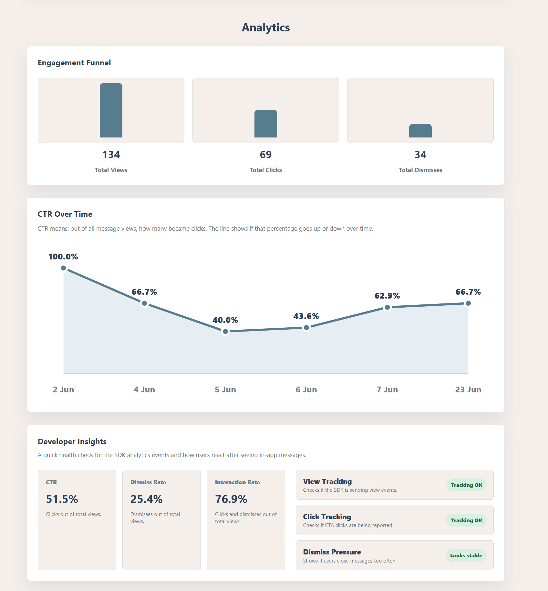
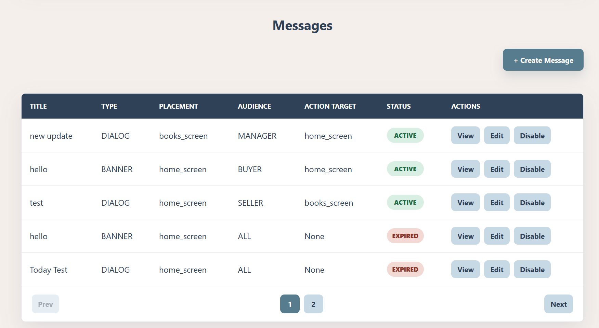
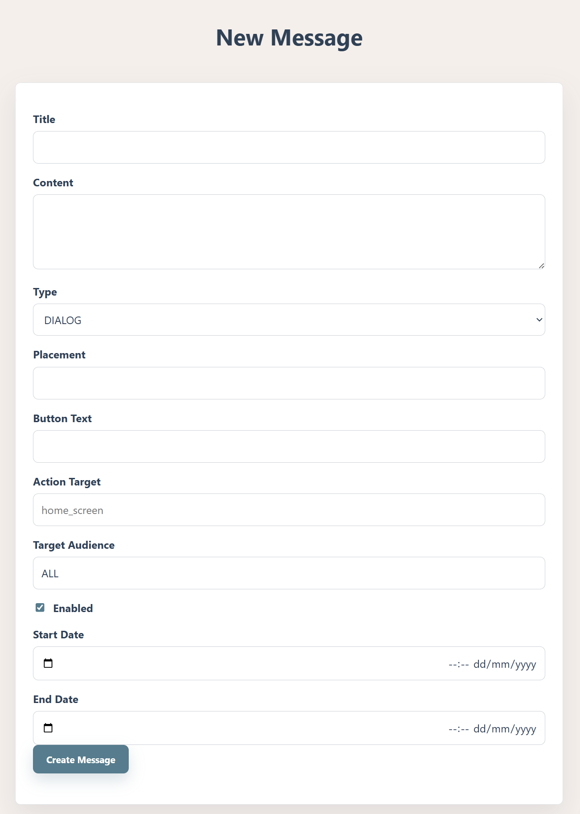
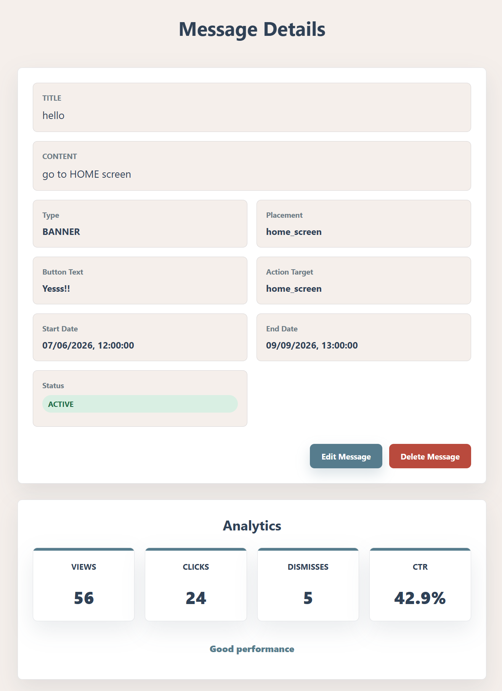
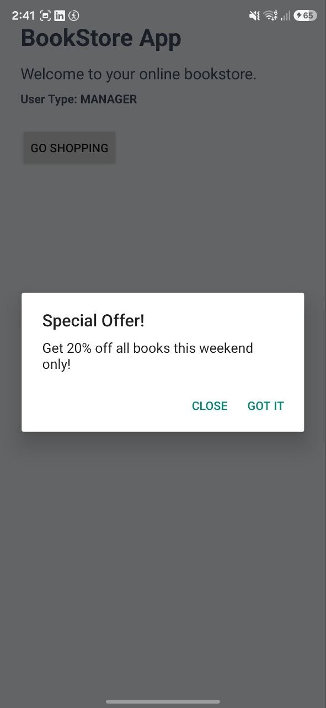
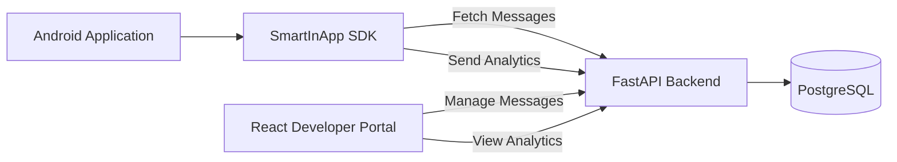
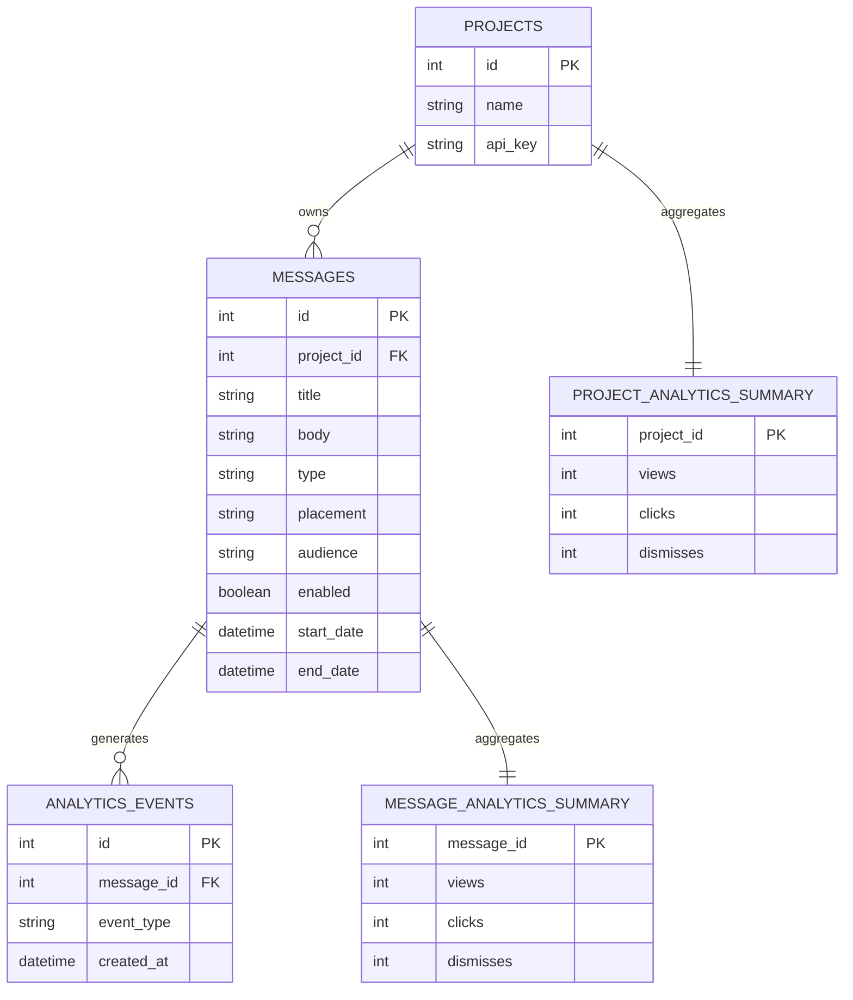
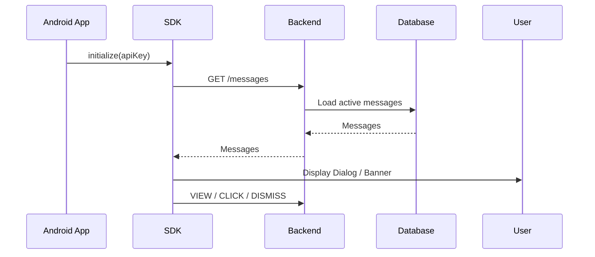
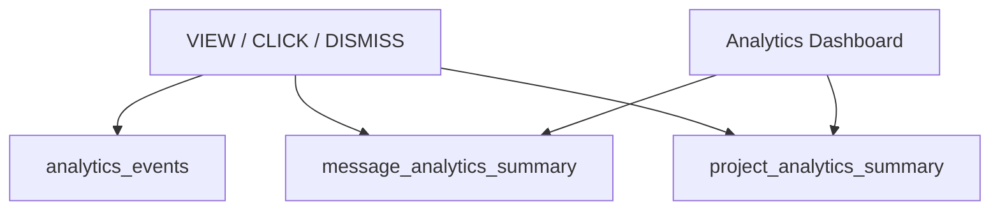
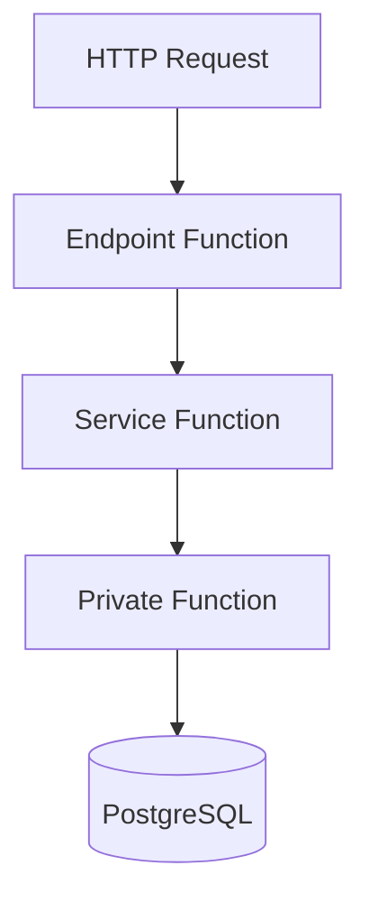

# SmartInApp SDK

A complete In-App Messaging platform for Android applications.

SmartInApp enables developers to create, manage, deliver, display, and analyze targeted in-app messages through a complete full-stack solution consisting of:

- Android SDK
- FastAPI Backend
- React Developer Portal
- PostgreSQL Database

---

# Features

## In-App Messaging

- Dialog Messages
- Top Banner Messages
- Placement-Based Delivery
- Audience Targeting
- Message Scheduling
- Enable / Disable Messages
- Offline Message Caching

## Android SDK

- Simple initialization using API Key
- Fetch active messages from backend
- Display Dialog and Banner messages
- Track analytics events
- Cache messages locally

## Developer Portal

- Project Login
- Create Messages
- Edit Messages
- Delete Messages
- Enable / Disable Messages
- Message Details View
- Analytics Dashboard

## Analytics

- View Tracking
- Click Tracking
- Dismiss Tracking
- CTR Calculation
- Interaction Rate
- Developer Insights
- Top Performing Messages
- CTR Over Time

---

# Screenshots

## Analytics Dashboard



## Messages Management



## Create Message



## Message Details



## SDK Dialog



## SDK Banner


---

# System Architecture



---

# Database ERD



---

# SDK Flow



---

# Analytics Optimization

To improve performance, analytics are stored in two layers.

### Raw Events

Every user interaction is stored in:

```text
analytics_events
```

### Summary Tables

The backend updates optimized summary tables in real time:

```text
message_analytics_summary
project_analytics_summary
```

This architecture prevents expensive aggregation queries on large datasets and allows analytics dashboards to load instantly.



---

# Backend Architecture

The backend is divided into three logical layers.

## Endpoint Functions

Receive HTTP requests from the SDK and Portal.

Examples:

```text
POST /portal/login
GET /messages
POST /analytics/event
GET /analytics/project/{id}
```

## Service Functions

Contain the business logic of the application.

Examples:

```text
create_message()
update_message()
delete_message()
save_analytics_event()
get_project_analytics()
```

## Private Functions

Internal helper functions used by the backend.

Examples:

```text
get_db_connection()
update_summary_tables()
get_message_status()
```

### Request Flow



---

# How To Use

## Backend

```bash
cd backend

pip install -r requirements.txt

uvicorn app:app --reload
```

## Developer Portal

```bash
cd portal

npm install

npm run dev
```

## Android SDK

Initialize the SDK:

```kotlin
SmartInApp.initialize(
    context = applicationContext,
    apiKey = "YOUR_API_KEY"
)
```

Display messages:

```kotlin
SmartInApp.showMessage(
    placement = "home_screen",
    userType = "BUYER"
)
```

---

# Technologies

| Layer | Technologies |
|---------|---------|
| Android SDK | Kotlin, Retrofit, Gson |
| Backend | Python, FastAPI, Psycopg2 |
| Database | PostgreSQL |
| Portal | React, Vite, Recharts |
| Tools | Git, GitHub, Android Studio, PyCharm, pgAdmin |

---

# Author

**Inbar Sar Israel**

B.Sc. Computer Science

Afeka Academic College of Engineering
