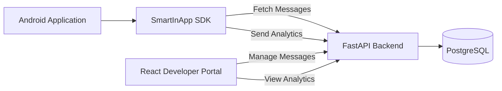
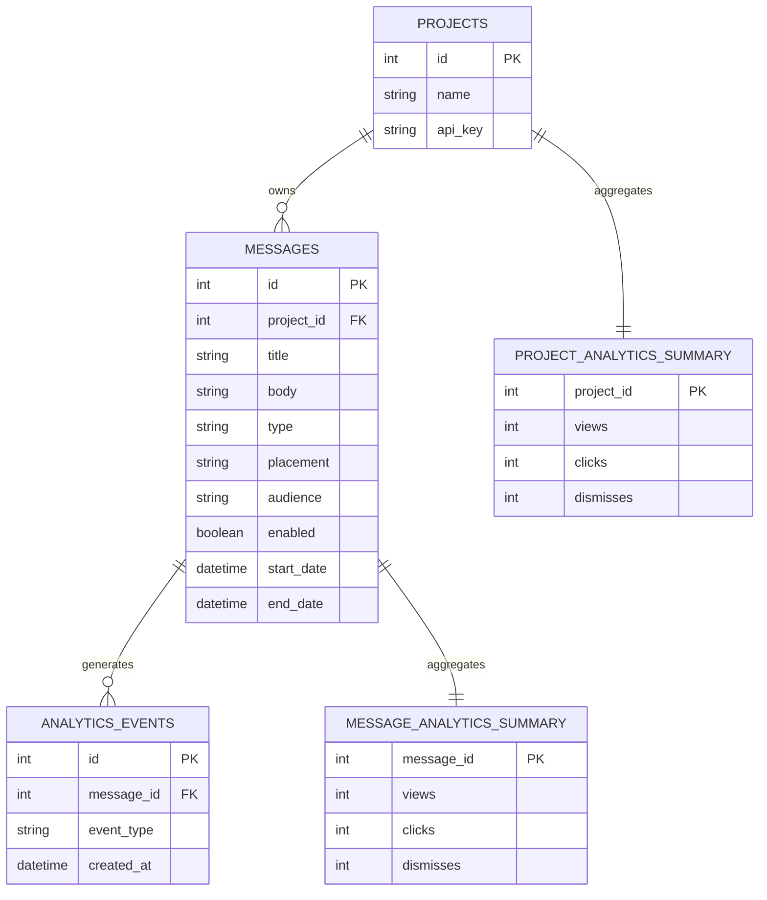
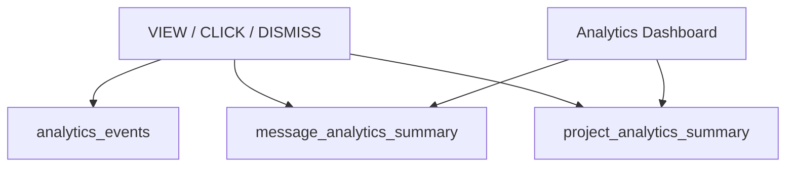
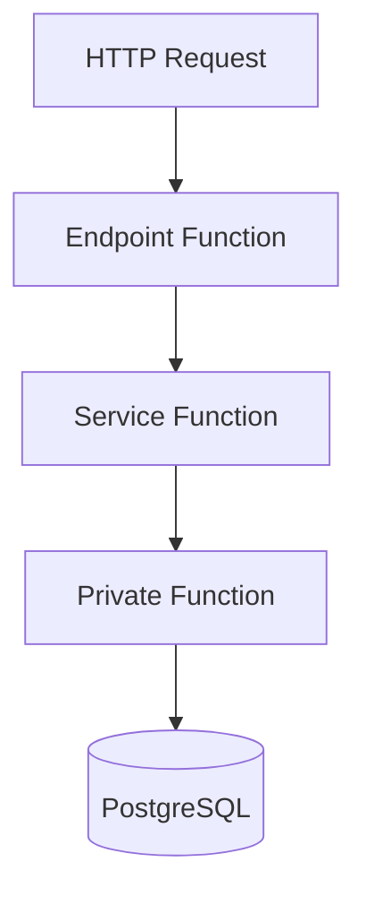

# SmartInApp SDK

A complete In-App Messaging platform for Android applications.

SmartInApp enables developers to create, manage, deliver, display, and analyze targeted in-app messages through a complete full-stack solution consisting of:

- Android SDK
- FastAPI Backend
- React Developer Portal
- PostgreSQL Database
- VitePress Documentation Website

Full developer documentation is available in [`docs/docs/index.md`](docs/docs/index.md). It explains how to integrate the Android SDK, initialize SmartInApp, load banner and dialog messages, configure audiences and placements, handle navigation actions, and understand the platform architecture.

---

# Features

## In-App Messaging

- Dialog Messages
- Top Banner Messages
- Placement-Based Delivery
- Audience Targeting
- Message Scheduling
- Enable / Disable Messages
- Offline Message Caching

## Android SDK

- Simple initialization using API Key
- Fetch active messages from backend
- Display Dialog and Banner messages
- Track analytics events
- Cache messages locally

## Documentation Website

- VitePress documentation page
- Android SDK integration guide
- Kotlin examples for banners, dialogs, audiences, and navigation
- API, database, analytics, and architecture explanations
- Project demo video

## Developer Portal

- Project Login
- Create Messages
- Edit Messages
- Delete Messages
- Enable / Disable Messages
- Message Details View
- Analytics Dashboard

## Analytics

- View Tracking
- Click Tracking
- Dismiss Tracking
- CTR Calculation
- Interaction Rate
- Developer Insights
- Top Performing Messages
- CTR Over Time

---

# Screenshots

## Analytics Dashboard


## Messages Management


## Create Message


## Message Details


## SDK Dialog


## SDK Banner


---

# System Architecture



---

# Database ERD



---

# Analytics Optimization

To improve performance, analytics are stored in two layers.

### Raw Events

Every user interaction is stored in:

```text
analytics_events
```

### Summary Tables

The backend updates optimized summary tables in real time:

```text
message_analytics_summary
project_analytics_summary
```

This architecture prevents expensive aggregation queries on large datasets and allows analytics dashboards to load instantly.



---

# Backend Architecture

The backend is divided into three logical layers.

## Endpoint Functions

Receive HTTP requests from the SDK and Portal.

Examples:

```text
POST /portal/login
GET /messages
POST /analytics/event
GET /analytics/project/{id}
```

## Service Functions

Contain the business logic of the application.

Examples:

```text
create_message()
update_message()
delete_message()
save_analytics_event()
get_project_analytics()
```

## Private Functions

Internal helper functions used by the backend.

Examples:

```text
get_db_connection()
update_summary_tables()
get_message_status()
```

### Request Flow



---

# How To Use

## Backend

```bash
cd backend

pip install -r requirements.txt

uvicorn app:app --reload --host 0.0.0.0 --port 8000
```

The `--host 0.0.0.0` option allows the Android demo app to reach the backend from an emulator or a physical device on the same network.

## Developer Portal

```bash
cd portal

npm install

npm run dev
```

## Android SDK

Initialize the SDK:

```kotlin
SmartInApp.setBaseUrl("http://10.0.0.15:8000/")

SmartInApp.initialize(
    context = applicationContext,
    apiKey = "YOUR_API_KEY"
)
```

Set the current user audience:

```kotlin
SmartInApp.setUserAudience("BUYER")
```

Display a banner message:

```kotlin
bannerView.load("home_screen")
```

Display a dialog message:

```kotlin
SmartInAppDialogs.load(
    context = this,
    placement = "home_screen"
)
```

Register navigation for message action buttons:

```kotlin
SmartInApp.setNavigationHandler { target ->
    when (target) {
        "books_screen" -> {
            startActivity(Intent(this, BooksActivity::class.java))
        }
    }
}
```

The SDK automatically filters messages by placement and audience. A user with audience `BUYER` can receive both `BUYER` and `ALL` messages for the same placement.

---

# Technologies

| Layer | Technologies |
|---------|---------|
| Android SDK | Kotlin, Retrofit, Gson |
| Backend | Python, FastAPI, Psycopg2 |
| Database | PostgreSQL |
| Portal | React, Vite, Recharts |
| Tools | Git, GitHub, Android Studio, PyCharm, pgAdmin |

---

# Author

**Inbar Sar Israel**

B.Sc. Computer Science

Afeka Academic College of Engineering
