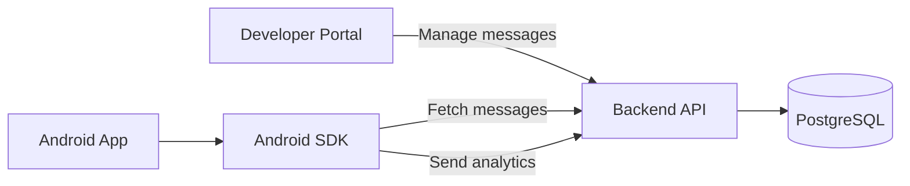
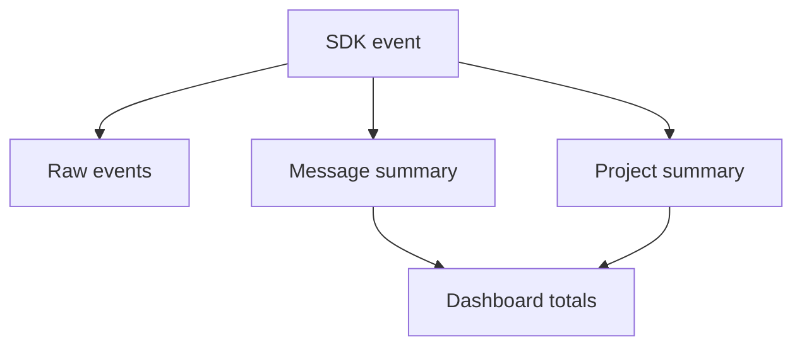
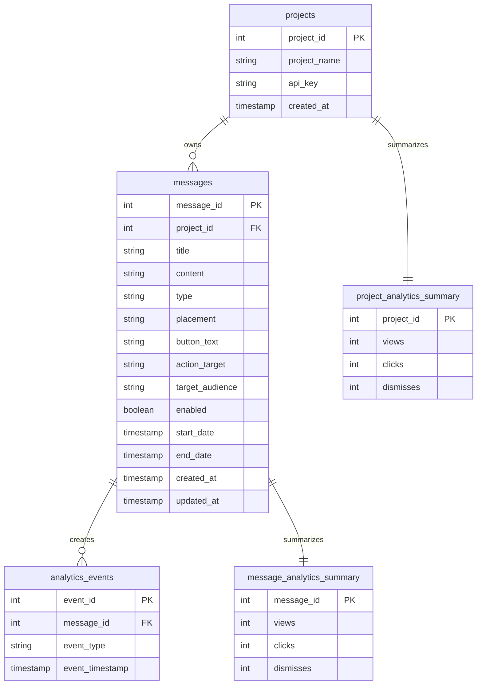

<div class="hero">
  <h1>SmartInApp Android SDK</h1>
  <p class="hero-kicker">Remote in-app messaging for Android</p>
  <p>
    Add targeted dialogs and banners to your Android app, handle message actions,
    and track engagement from one simple Kotlin SDK.
  </p>
</div>

## What you can build

Use SmartInApp when you want to manage app messages from a web dashboard instead of hard-coding every announcement in the Android app.

Common examples:

| Use case | Example |
| --- | --- |
| Product announcement | Show a dialog when users open the home screen |
| Promotion | Show a top banner for a sale or upgrade offer |
| Screen-specific message | Show one campaign on `home_screen` and another on `books_screen` |
| Audience targeting | Show different messages for `BUYER`, `SELLER`, or `MANAGER` users |
| Analytics | Measure views, clicks, dismisses, CTR, and engagement |

The SDK works with the SmartInApp backend and Developer Portal:



## Quick start

The usual integration flow is:

`Initialize the SDK` -> `Set the audience` -> `Register navigation` -> `Load a banner or dialog`

### 1. Add the SDK module

In this project, the SDK is included as a local Android library module:

```kotlin
// settings.gradle.kts
include(":smartinapp-sdk")
```

Add it to your Android app dependencies:

```kotlin
// app/build.gradle.kts
dependencies {
    implementation(project(":smartinapp-sdk"))
}
```

The SDK module includes Retrofit and Gson for backend communication.

### 2. Initialize SmartInApp

Initialize the SDK once when your app starts.

```kotlin
import com.smartinapp.sdk.SmartInApp
import kotlinx.coroutines.MainScope
import kotlinx.coroutines.launch

private val activityScope = MainScope()

override fun onCreate(savedInstanceState: Bundle?) {
    super.onCreate(savedInstanceState)

    SmartInApp.setBaseUrl("http://10.0.0.15:8000/")

    activityScope.launch {
        SmartInApp.initialize(
            context = this@MainActivity,
            apiKey = "pk_test_bookstore_123"
        )
    }
}
```

The demo app uses a local network IP. For an Android emulator, `10.0.2.2` is often used to reach a backend running on the same computer. On a real device, use the machine IP or a deployed backend URL.

### 3. Set the current audience

An audience is a category that describes the current user, such as `BUYER`, `SELLER`, `MANAGER`, or `PREMIUM`. It is not a specific user ID. Your app decides which audience value represents the signed-in user.

Set the audience after you know the user's role and before loading banners or dialogs:

```kotlin
SmartInApp.setUserAudience("BUYER")
```

Messages with `target_audience = "ALL"` can be shown to every user. A message with a specific audience is shown only when its value matches the audience set in the SDK.

Audience targeting is optional. If your app does not call `setUserAudience()`, the SDK uses `ALL`. Call it again when the signed-in user or their role changes.

### 4. Show a banner

<div class="sdk-preview-row">
<div>

Add the banner view to a screen layout and load messages for a placement.

```xml
<com.smartinapp.sdk.SmartInAppBannerView
    android:id="@+id/smart_banner"
    android:layout_width="match_parent"
    android:layout_height="wrap_content" />
```

```kotlin
import com.smartinapp.sdk.SmartInAppBannerView

private lateinit var bannerView: SmartInAppBannerView

override fun onCreate(savedInstanceState: Bundle?) {
    super.onCreate(savedInstanceState)
    setContentView(R.layout.activity_home)

    bannerView = findViewById(R.id.smart_banner)
    bannerView.load("home_screen")
}
```

The banner view fetches banner messages, shows the first available one, tracks views, and tracks clicks or dismisses.

</div>
<div>


</div>
</div>

### 5. Show dialog messages

<div class="sdk-preview-row">
<div>

Use `SmartInAppDialogs.load()` when a placement should display dialog campaigns.

```kotlin
import com.smartinapp.sdk.SmartInAppDialogs

SmartInAppDialogs.load(
    context = this@HomeActivity,
    placement = "home_screen"
)
```

The helper loads dialog messages for the placement, avoids showing the same message twice in one app session, and automatically sends analytics events.

</div>
<div>


</div>
</div>

### 6. Placements

A placement is a string that represents where the message can appear.

Examples:

```text
home_screen
books_screen
checkout_screen
profile_screen
```

The Android app asks for a placement:

```kotlin
bannerView.load("books_screen")

SmartInAppDialogs.load(
    context = this@BooksActivity,
    placement = "books_screen"
)
```

The backend returns only active messages for that placement and project API key.

### 7. Handle message actions

Messages can include an `action_target`. Your app decides what that target means.

When the user clicks a message button, the SDK tracks the click and sends the target to this navigation handler.

```kotlin
SmartInApp.setNavigationHandler { target ->
    when (target) {
        "books_screen" -> {
            startActivity(Intent(this, BooksActivity::class.java))
        }
        "home_screen" -> {
            startActivity(Intent(this, HomeActivity::class.java))
        }
    }
}
```

## SDK functions you can use

These are the main SDK functions available when integrating SmartInApp into your Android application.

| Function | When to call it | What it does |
| --- | --- | --- |
| `SmartInApp.setBaseUrl(url)` | Once, before `initialize()` | Sets the backend server URL |
| `SmartInApp.initialize(context, apiKey)` | Once when the app starts | Connects the app to a SmartInApp project |
| `SmartInApp.setUserAudience(audience)` | After the user's role is known and before loading messages | Selects which targeted messages the user can receive |
| `bannerView.load(placement)` | When a screen containing a banner is ready | Loads and displays the first matching banner |
| `SmartInAppDialogs.load(context, placement)` | When a screen should check for a dialog message | Loads and displays the first matching dialog |
| `SmartInApp.setNavigationHandler(handler)` | Before the user can click a message action | Registers the app's navigation logic for action targets |
| `SmartInApp.refresh()` | Only when fresh project data or repeated display is needed | Reloads project data and clears the messages shown in the current session |

The SDK also contains lower-level message fetching and analytics functions, but a normal app integration does not call them directly.

`refresh()` is not required every time a screen opens. Because it allows previously shown messages to appear again, call it only when the app intentionally needs to reload the project state.

## Offline fallback

SmartInApp keeps a small local cache of the last messages fetched for each placement. If the backend is temporarily unavailable, the SDK falls back to the cached messages instead of failing immediately.

This means the app can still show the most recently loaded messages even if the server is down or the network request fails. New portal changes will appear after the backend is available again and the SDK successfully fetches fresh messages.

## Message fields

When creating a message in the portal or API, these are the important fields:

| Field | Description |
| --- | --- |
| `project_id` | Project that owns the message |
| `title` | Message title shown in the app |
| `content` | Main message text |
| `type` | `DIALOG` or `BANNER` |
| `placement` | Screen or app area where the message appears |
| `button_text` | Optional CTA button label |
| `action_target` | Optional navigation target handled by the app |
| `target_audience` | Optional audience value, defaults to `ALL` |
| `enabled` | Whether the message is active. New messages are enabled by default and can be changed with the enabled endpoint |
| `start_date` | Optional start date |
| `end_date` | Optional end date |

Example create-message request:

```json
{
  "project_id": 1,
  "title": "Welcome offer",
  "content": "Get 20% off your first order.",
  "type": "DIALOG",
  "placement": "home_screen",
  "button_text": "Open offer",
  "action_target": "books_screen",
  "target_audience": "BUYER",
  "start_date": "2026-06-23T09:00:00",
  "end_date": "2026-07-01T09:00:00"
}
```

## Developer Portal

The Developer Portal is the web UI used to manage what the SDK displays.

Developer workflow:

1. Create a project if you do not already have an API key.
2. Log in with a project API key.
3. Create a dialog or banner message.
4. Choose a placement such as `home_screen`.
5. Optionally choose an audience such as `BUYER`.
6. Enable the message.
7. Open the Android app and let the SDK fetch the message.
8. Review analytics in the dashboard.


Use the messages table to review campaigns, open message details, edit content, enable or disable messages, and delete old campaigns.


The create screen matches the fields used by the SDK: type, placement, audience, CTA button, and action target.


The details page is useful when you want to inspect one campaign and check its individual analytics.


The dashboard shows views, clicks, dismisses, CTR over time, top messages, an engagement funnel, and developer insights.

## Frequently asked questions

::: details Which backend endpoints does the platform expose?

Portal and message management:

| Method | Endpoint | Description |
| --- | --- | --- |
| `POST` | `/projects` | Create a new project and return its generated API key |
| `POST` | `/portal/login` | Log in with an API key and return project data |
| `GET` | `/messages/project/{project_id}` | Return all messages for a project |
| `GET` | `/messages/project/{project_id}/status-summary` | Return message counts by `active`, `future`, `disabled`, and `expired` status |
| `POST` | `/messages` | Create a new message |
| `PATCH` | `/messages/{message_id}` | Update message fields |
| `PATCH` | `/messages/{message_id}/enabled` | Enable or disable a message |
| `DELETE` | `/messages/{message_id}` | Delete a message |

SDK and analytics:

| Method | Endpoint | Description |
| --- | --- | --- |
| `GET` | `/sdk/messages` | Return active messages for an API key and optional placement |
| `POST` | `/analytics/view` | Track a view event |
| `POST` | `/analytics/click` | Track a click event |
| `POST` | `/analytics/dismiss` | Track a dismiss event |
| `GET` | `/analytics/{message_id}` | Return analytics for one message |
| `GET` | `/analytics/project/{project_id}` | Return project-level analytics totals |
| `GET` | `/analytics/project/{project_id}/top-messages` | Return top messages by CTR |
| `GET` | `/analytics/project/{project_id}/ctr-over-time` | Return CTR data over time |

:::

::: details How does SmartInApp keep analytics fast?

SmartInApp keeps both raw events and ready-to-read summary counters.

Raw events are stored in:

```text
analytics_events
```

Summary counters are stored in:

```text
message_analytics_summary
project_analytics_summary
```

This means the dashboard does not need to recalculate views, clicks, and dismisses from all raw events every time it loads.



:::

::: details What does the database model look like?



:::

::: details What are the main project components?

SmartInApp is built as a complete platform:

| Component | Purpose |
| --- | --- |
| Android SDK | Kotlin SDK used by Android apps to fetch and display messages |
| Demo Android app | Example app showing audience selection, banners, dialogs, and navigation |
| FastAPI backend | Serves messages, validates projects, and receives analytics events |
| PostgreSQL database | Stores projects, messages, raw analytics, and summary counters |
| React Developer Portal | Web dashboard for managing messages and analytics |

:::

## Project videos

These videos show the idea behind SmartInApp and how it works in the demo project.

### Why use SmartInApp SDK?

See how SmartInApp helps update in-app messages remotely without releasing a new app version.

<video class="implementation-video" controls>
  <source src="/videos/ad-sdk.mp4" type="video/mp4" />
  Your browser does not support the video tag.
</video>

### Project demo

See the full flow: create a message, display it in the Android app, and view analytics in the portal.

<video class="implementation-video" controls>
  <source src="/videos/demo.mp4" type="video/mp4" />
  Your browser does not support the video tag.
</video>

<style>
.hero {
  padding: 56px 0 34px;
}

.hero-kicker {
  margin: 0 0 12px;
  color: var(--vp-c-brand-1);
  font-weight: 700;
}

.hero h1 {
  max-width: 920px;
  margin: 0;
  font-size: 48px;
  line-height: 1.08;
  letter-spacing: 0;
}

.hero p:last-child {
  max-width: 760px;
  margin-top: 20px;
  font-size: 18px;
}

.implementation-video {
  display: block;
  width: 100%;
  max-height: 560px;
  margin-top: 18px;
  border: 1px solid var(--vp-c-divider);
  border-radius: 8px;
  background: #000;
}

.VPDoc.has-aside .container {
  max-width: 1500px !important;
}

.VPDoc.has-aside .content-container {
  max-width: 1040px !important;
}

.mermaid {
  display: flex;
  justify-content: center;
  overflow-x: auto;
  padding: 16px 0;
}

.mermaid svg {
  max-width: 100%;
  height: auto;
}

.sdk-preview-row {
  display: grid;
  grid-template-columns: minmax(580px, 1fr) 320px;
  gap: 44px;
  align-items: start;
  margin: 16px 0 36px;
}

.sdk-preview-row > div {
  min-width: 0;
}

.sdk-preview-row .language-xml,
.sdk-preview-row .language-kotlin {
  margin-top: 14px;
}

.mobile-preview {
  display: block;
  width: min(100%, 300px);
  margin: 0 auto;
  border: 1px solid var(--vp-c-divider);
  border-radius: 8px;
}

.custom-block.details {
  margin: 0;
  padding: 0;
  border: 0;
  border-radius: 0;
  background: transparent;
  border-bottom: 1px solid var(--vp-c-divider);
}

.custom-block.details summary {
  display: flex;
  align-items: center;
  justify-content: space-between;
  min-height: 82px;
  padding: 0;
  cursor: pointer;
  color: var(--vp-c-text-1);
  font-size: 24px;
  font-weight: 700;
  letter-spacing: 0;
}

.custom-block.details summary::marker {
  content: "";
}

.custom-block.details summary::-webkit-details-marker {
  display: none;
}

.custom-block.details summary::after {
  content: "⌄";
  margin-left: 24px;
  color: var(--vp-c-text-2);
  font-size: 26px;
  font-weight: 400;
  transition: transform 0.18s ease;
}

.custom-block.details[open] summary::after {
  transform: rotate(180deg);
}

.custom-block.details > :not(summary) {
  padding-bottom: 28px;
}

.custom-block.details img {
  margin: 18px 0 10px;
  border: 1px solid var(--vp-c-divider);
  border-radius: 8px;
}

@media (max-width: 1180px) {
  .sdk-preview-row {
    grid-template-columns: 1fr;
    gap: 18px;
  }

  .mobile-preview {
    width: min(100%, 300px);
  }
}

@media (max-width: 720px) {
  .hero {
    padding-top: 32px;
  }

  .hero h1 {
    font-size: 34px;
  }

  .custom-block.details summary {
    min-height: 68px;
    font-size: 19px;
  }
}
</style>
